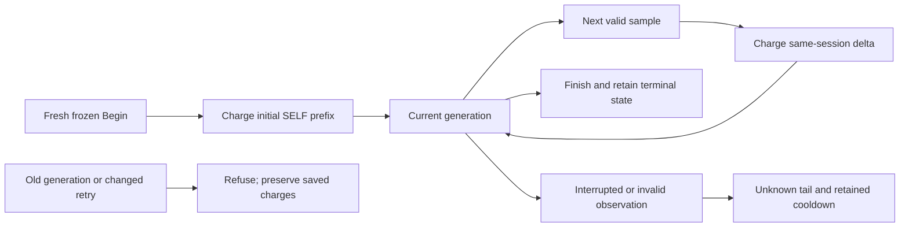

# ADR 005 — Conservative CPU charges across Run sessions

- Date: 2026-10-09
- Status: accepted design for a library-only implementation; worker integration and native acceptance remain pending
- Scope: P1-06b12 / P1-06b13a

## Decision

Prepare a constant-size `worker_self_cpu_charges_v1` ledger for one private state store. Charge the full initial cumulative SELF CPU counter for each fresh Run session, then positive counter deltas within that session. Preserve permanent session generations, exact frozen retries, wall high-water and retained cooperative cooldowns.

These are conservative charges. Repeated Run calls or exec can charge overlapping prefixes. Unknown intervals can also leave CPU unobserved. The aggregate must claim neither unique lifetime CPU nor an upper bound on all CPU consumption. It is not a CPU quota for a UTC hour or day, or a hard preemption mechanism.

The existing dispatch-window feedback remains separate. The next leaf adds only a library ledger and generated tests; it does not enable a worker gate, change defaults or accept resource targets.

## Why session identity needs a protocol

Linux SELF includes all threads in the calling process, and resource usage survives exec. Apple documents cumulative process user and system CPU. A per-Run random instance or PID therefore cannot make the initial counter exclusive to that Run. In an embedding process, unrelated goroutines also contribute. [Linux getrusage](https://man7.org/linux/man-pages/man2/getrusage.2.html), [Apple getrusage](https://developer.apple.com/library/archive/documentation/System/Conceptual/ManPages_iPhoneOS/man2/getrusage.2.html)

A latest-only native birth record cannot deduplicate session A after another session B replaces it. Exact unique accounting would need a verified birth identity and retained no-eviction history with its own capacity and platform gates. This slice uses explicit overlap instead.

| Observation | Charge | Qualification |
| --- | --- | --- |
| Fresh session, SELF = 100 | 100 | Full process prefix; earlier charges can overlap |
| Same session, SELF = 120 | 20 | Delta from its last valid counter |
| New session, SELF = 130 | 130 | Conservative fresh prefix |
| Same session B, SELF = 140 | 10 | Same-session delta |
| Aggregate | 260 | Unique current-process prefix is only 140 in this example |

## Bounded replay and interruption rules

Keep one singleton with the permanent signed 64-bit generation, latest fixed-size Begin/sample requests, bounded session identity, charges, counts, clock high-water and cooldown. Refuse overflow and malformed state without resetting debt or granting dispatch. Historical reads and controls must remain available.

1. Begin requires the exact expected generation and a frozen bounded nonce, instance, initial observation and wall stamp. One transaction settles an interrupted former session once, advances the generation and saves the fresh prefix charge. It cannot shorten an existing cooldown.
2. An exact latest Begin retry returns its current saved state without another charge, timestamp, recovery or usable marker. Only the original writer's initial or qualified marker can continue that session. A reopened writer must explicitly recover or begin fresh tracking. Changed requests and older generations are stale. A-to-B-to-old-A replay cannot revive A.
3. Each sample requires the current writer-bound marker and next ordinal. An exact retry of the latest sample charges once. Older or changed samples are stale. Reopening storage does not validate an old writer marker.
4. Counter failure/regression, invalid elapsed evidence or clock rollback never becomes a fabricated zero. Preserve known charges and close the affected session as unknown with the fixed fallback cooldown. Explicit interruption recovery occurs once.
5. Finish saves its final sample and terminal state atomically. An uncertain commit preserves the frozen request and reports uncertainty; it does not automatically create a fresh session. Exact retries must distinguish saved terminal state from permission to resume work.

## Clock and measurement limits

Initial prefix debt has no verified corresponding live elapsed interval. Any later admission gate must repay it prospectively instead of crediting pre-Run process age. Same-session deltas can use separately validated elapsed intervals. UTC high-water orders durable publications; live monotonic anchors preserve an established delay across wall adjustments. Serialized timestamps lose their monotonic component. [Go monotonic clocks](https://pkg.go.dev/time#hdr-Monotonic_Clocks)

Midnight, an hour boundary, restart or a clock adjustment cannot refund charges. A capped cooldown is cooperative feedback, not proof of a lifetime percentage. A fixed unknown-tail cooldown is a policy response, not a measured upper bound on missing CPU.

Sampling before dispatch, after settlement and at graceful termination can include startup, planning, controls and prior publication costs. A sample cannot include its own final publication, close or process-exit tail. Loss before the first tracking commit remains unknown. SELF excludes child processes. Other stores do not coordinate their charges.

## Acceptance before worker integration

Require strict schema/type/cardinality validation, atomic activation, exact retry and stale-writer tests, no-wrap arithmetic, rollback/midnight behavior and once-only recovery. Generated native process loss must prove actual SIGKILL and reap. Definite rollback and uncertain commit/reply need separate assertions.

Later worker integration must preserve every existing resource/source gate, responsive pause/status/stop and the absence of idle native polling. Validate four build targets and genuine native macOS/Linux behavior. Whole-process attribution, hard CPU limits, physical power and representative hourly/soak acceptance remain open.
