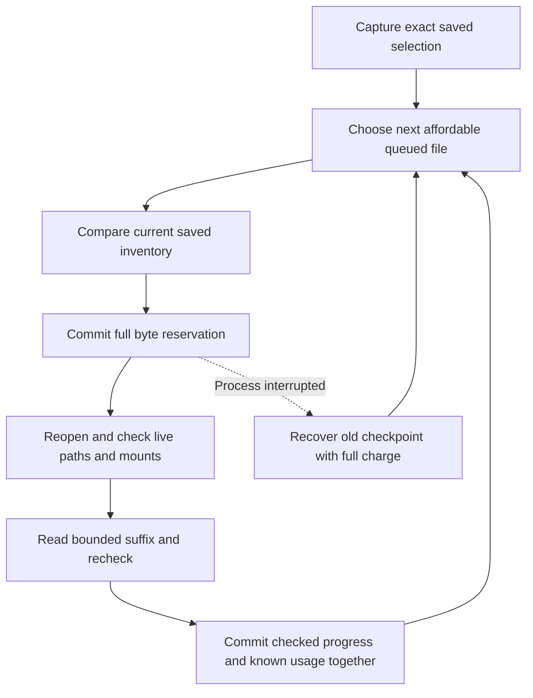

# Experimental inventory (P1-05)

## Activation and persistence

`rydd daemon --experimental-scan` runs one metadata inventory over configured roots, with persistent directory jobs. The flag must be supplied on every start. Ordinary daemon mode never dispatches inventory jobs, including ones left by an experimental run. Budget enforcement is still P1-06 work; use disposable fixtures only. Restarting experimental mode seeds a root revisit while preserving pending jobs. Adaptive scheduled revisits are P1-07 work.

Each batch reads at most 128 names via `File.Readdirnames(n)`, without sorting or loading a whole directory. It gathers no-follow stat metadata, including logical size, allocated blocks, modification/change times, device/inode hints, raw path bytes and skip reasons. Ordinary file contents are never opened. Allocated blocks do not prove exclusive ownership of extents or reclaimable space.

A single directory descriptor and its initial metadata stamp survive between batches. A cursor identifies the live stream's last committed batch, not a filesystem offset. On process restart, lost cursor, changed directory or cancellation, enumeration restarts with a new random generation. Idempotent upserts preserve committed observations. Directory continuation runs before child jobs so a bounded single-stream implementation makes progress; fair scheduling and durable continuation across repeated restarts remain P1-07 work. The default 128-name batch and five-minute cadence favor low activity over throughput.

The owning worker event loop uses one short transaction for lease validation, metadata upserts, child-job insertion, directory reconciliation state and cursor/completion. Rollback leaves all of them unchanged. Root/filesystem identity is bound in that transaction and must match future batches. Handlers never hold a database connection.

## Reconciliation and failures

Schema v3 adds `entries.skip_reason` and a `directories` table. A directory's generation is marked complete only at EOF after unchanged inode/device/mtime/ctime checks, including reopening its current path. Errors save a bounded message and schedule an hour-later retry; they never clear existing observations. Inaccessible child directories and excluded/mounted/provider paths receive skip reasons instead of traversal jobs.

The complete generation is a watermark for a successful direct-child pass. A child observation from another generation is unconfirmed in that pass. Retain those observations: no large SQL sweep or recursive deletion occurs during a batch. Descendant invalidation, stale-entry lifecycle and report filtering belong to P1-07/P1-08. Root `last_scan_ns` means its own directory was enumerated, not that the entire tree finished. Summary counts include historical observations; they are not proof that each saved pathname still exists or that coverage is complete.

Before/after metadata checks reduce path-change errors but cannot create an atomic filesystem snapshot. Device/inode fingerprints remain scoped hints, not future cleanup authorization. Later actions must freshly revalidate targets.

## Filesystem scope

Configured root aliases are resolved before opening. Available roots with overlapping canonical paths or identical filesystem objects are rejected at startup. Descendants are opened component-by-component with directory-only/no-follow flags and before/after identity checks. Symlinks are recorded as symlinks, not traversed. Exclusions, Rydd config/state/runtime paths, known system paths, the current user's macOS Library, `.git`, Trash and selected backup/snapshot directory names are protected. Existing protected objects are also recognized by device/inode, covering private-file aliases and case variations.

Root fingerprints include canonical path, filesystem identity, device and inode. A changed or missing root produces an error while preserving old inventory. Linux mount IDs are used for live boundaries, including same-filesystem bind mounts; they are deliberately excluded from persistent fingerprints because they change after remounting. macOS uses filesystem ID and mount location. Nested mounts are skipped even if their filesystem is otherwise supported.

The initial filesystem allowlist is deliberately small:

| Platform | Accepted filesystem metadata interfaces |
| --- | --- |
| macOS | APFS, HFS |
| Linux | ext-family, Btrfs, XFS, tmpfs, overlay (container fixtures) |

Other filesystem types, including FUSE/network providers, are refused. Linux requires `statx` mount IDs; unsupported kernels fail closed. Docker host bind shares may use an unsupported filesystem, so scanner fixtures use the container's `/tmp`. A physical device renumbering can conservatively invalidate a saved fingerprint; user-reviewed rebinding is not implemented yet. Do not erase an existing database to work around a mismatch.

macOS dataless flags are checked before opening directories and before traversal; known Library-based cloud roots are protected. Actual provider hydration/race behavior is not yet validated. Provider-managed roots must stay out of experimental tests and broad scanning until native avoidance controls and tests are complete. See [Apple TN3150](https://developer.apple.com/documentation/technotes/tn3150-getting-ready-for-data-less-files) and [Apple's flag definitions](https://github.com/apple/darwin-xnu/blob/main/bsd/sys/stat.h).

## Resource and validation boundaries

Metadata arrays and directory descriptors are bounded independently of tree size. Stored paths are limited to 4096 bytes and error/cursor sizes are bounded. Cooperative checks cannot interrupt an already blocked kernel filesystem call. Scanner close does not wait on that call during shutdown; the process can exit and a later owner recovers saved work. Full power/CPU/I/O consumption budgets and diagnostics are still required before unattended use.

Tests cover multi-batch restart, rollback after partial SQL work, stale lease/root identity rejection, symlinks, FIFOs, sparse/hardlinked files, private aliases, missing and permission-denied directories, root replacement and a killed worker completing a 20-level tree. Linux CI exercises a real bind mount in a private namespace. Native CLI smoke tests scan five synthetic entries and stop their worker. These are correctness fixtures, not a million-entry benchmark, physical laptop sleep/remount trial or provider-hydration guarantee.

API references: [Go directory enumeration](https://go.dev/src/os/dir.go), [Unix filesystem APIs](https://pkg.go.dev/golang.org/x/sys/unix).

## Paced partial batches

The worker supplies an entry-inspection rate. A throttle-window deadline produces a partial batch while preserving up to 128 pending names in the current stream. Final pathname/stamp validation still runs before that batch is committed. A throttle yield keeps the generation; actual cancellation, mutation, lost cursor or process restart retains the existing restart-and-upsert behavior. See [CLI contract](cli.md#child-entry-pacing) for the exact rate scope and remaining limits.

## Explicit file observations and durable hashing

Metadata scans still open no ordinary file contents. Separate library requests can capture exact saved evidence, observe bounded samples or calculate a full SHA-256 hash. Capture and observation requests do not themselves supply consent or cleanup permission. Explicit CLI full-file approval and one-step continuation use the separate consent gate below. `rydd hashes [--work WORK_ID | --groups] [--json]` reads existing historical observations or matching completed groups and their whole-selection budget. Background integration remains pending.

The durable hashing store keeps one frozen selection of 1–20 files, with at most 1 MiB of evidence, in a separate private `hashes/hashes.sqlite3` database. Its writer holds an exclusive lock for its lifetime. Inventory rebuilds do not remove hashing records. The store accepts no imported SHA state, caller-supplied offset, usage receipt or final digest.

Each call grants at most 1 MiB. A persisted indexed order rotates reserved work behind its peers, including after cancellation or recovery. Partial grants are rounded down to complete 64-byte SHA blocks. A smaller allowance defers without reservation or source reads, unless it can finish the exact remaining tail. A bounded search can let an affordable small tail proceed while a larger file waits. This is fairness within one finite batch, not a production scheduler or latency guarantee.

Partial checkpoints store the SHA chaining state at the last complete block and zero the entire buffered-byte area. Restart can repeat at most 63 checked bytes. Completed records contain only the final digest and cannot resume as prefix state. Version, runtime, platform, count, checksum and exact store/selection/file/sequence bindings are checked before reading. Incompatible records are refused; they never silently restart a file. The current saved inventory and live identity, stamp, scope and mount are checked on every continuation. Metadata checks cannot establish an atomic content snapshot across slices.

The reservation is permanent. Known usage and the next checked checkpoint are committed together; cancellation before publication retains the previous checkpoint while settling known usage. If a process dies before settlement, recovery keeps that checkpoint and the full charge. It marks requested/read/elapsed usage as unknown, rather than inventing zero. An uncertain publication stops dispatch until close and reopen. Previously committed progress survives a lost or canceled reply; a canceled request returns no live digest.

| Saved value | Meaning |
| --- | --- |
| Reserved bytes | Full allowances charged before reads; never refunded |
| Observed requested bytes | Read requests from attempts with known settlement |
| Observed read bytes | Bytes returned by those settled read requests |
| Unknown reserved bytes | Charges whose interrupted attempts have unknown usage |
| Durable offset | Checked prefix saved at a SHA block boundary, or completed file size |
| Completed digest | Historical full-read observation; no current-file or duplicate claim |

Unsettled reservations remain fully charged with null usage; the unknown-reservation counters include them only after writer recovery marks an interrupted attempt. Daily counters use the UTC day of reservation. A saved clock high-water blocks backward clock changes; rollover resets only current-day counters. These values do not measure physical disk I/O or limit reads by their actual wall-clock day. Storage retains only the latest checkpoint and attempt per file plus aggregate counters, with no per-slice history. Checksums detect inconsistent corruption and swapped records, not coherent same-user rewrites or whole-store rollback. Process-crash fixtures do not establish power-loss durability. All provenance, current-content, duplicate and execution flags remain false; estimated reclaimable bytes remain unknown.

## Exact unapproved hashing proposals

The singular `hash` command captures one manual-root proposal from complete selected rows in an explicitly named saved same-size report. Its JSON input is limited to 1 MiB and 1–20 unique explicit saved file IDs. Current saved inventory must still match those rows. Newly captured root and ancestor evidence is part of the frozen proposal; it is not proof of current source files. No scanner or selected source-content read is involved.

Selection payload version 2 adds a manual-inventory locator: authoritative raw root path and its derived key under the same application state directory. All selected roots must match it exactly. Legacy version 1 library selections remain available through saved reports and proposal display, with no fabricated locator or read authority. One store still supports only one immutable selection; a retry returns matching evidence, and changed/different evidence cannot replace it.

Selection-mode writers can initialize private storage but skip attempt recovery and refuse work dispatch. `hash --show` uses only an existing reader and works without source folders or inventory. Complete bounded proposal JSON exposes root/file/ancestor evidence, with no checkpoint state or source bodies. Returned evidence is copied, so a caller cannot alter the stored proposal through mutable slices. Both commands retain false verification/execution flags and unknown savings. A canceled or lost response can follow a committed selection; display or a matching explicit retry recovers it without implicit source reads.

## Store-owned full-file read consent

The library can record one separately confirmed approval for an exact manual-root proposal. It binds the store, selection, inventory, raw root and derived inventory key to `explicit_full_file_hash_read_v1`. Approval fixes a 24-hour expiry, a 1 MiB step ceiling, and explicit daily and lifetime reservation caps. Earlier reservations count toward the lifetime cap. Retrying cannot replace the scope, raise either cap or extend expiry. Legacy selections without a manual locator cannot receive this approval.

One guarded library call checks consent before choosing work and again with fresh time and accounting inside reservation publication. Current saved evidence, protected storage and live descriptor/mount checks remain required. Canceled and interrupted attempts keep their full charges across restart and UTC day rollover. Once consent exists, the unguarded foundation dispatcher refuses that selection. This gate is not worker integration or authority for an original-file trial.

Hash-store schema 2 holds immutable approval and revocation records plus monotonic clock and observed-expiry state. Ordinary writers migrate valid schema 1; readers never migrate. Schema 3 adds immutable historical role choices without changing these consent records. Saved snapshots read schema version and consent together, including when an already-open reader spans an upgrade. Reader output describes recorded state and leaves current permission unevaluated. Writer calls latch observed expiry, which cannot be reversed by a later backward clock.

Revocation needs no source or inventory. It takes the writer lock and blocks later reservations; it cannot interrupt a step already holding that lock or a blocked kernel call. A step also has a cooperative deadline bounded by five seconds and the remaining approval lifetime. Expiry or cancellation preserves the old checkpoint, settles known usage when possible and returns no live digest. The manual locator is a logical evidence binding; CLI dispatch must open only the inventory path derived from that locator under the same global state directory.

Approval and revocation publication can survive a lost response. Saved `hash --show` and `hashes` expose the consent ID and records without recovering work, changing clock observations or opening source contents. Human output distinguishes an unapproved selection from recorded, revoked or writer-observed expired consent. Current duplicate verification, keeper choices, savings and cleanup remain separate.

The explicit `hash --approve`, `--run` and `--revoke` modes preflight existing saved IDs. Approval and revocation use selection-mode writers without source/configuration reads or work recovery. Run opens only the manual inventory derived from the frozen root/key under the same global state directory. It applies configuration exclusions and protects global state/configuration. Missing configuration is allowed; invalid or changed configuration is refused. Configuration reads are separately bounded to 1 MiB from one held, no-follow, private single-link descriptor. Known selected identities are refused before those bytes are read. The derived inventory gets a metadata-only private identity/link check before SQLite opens it; the SQLite path API does not authenticate concurrent same-user private-path substitution.

One run calls the guarded dispatcher once, without retries, loops or scope/limit overrides. Normal writer opening may recover interrupted accounting before later refusal. Successful output separates durable prefix, live checked progress, full charges and known usage. Errors use the standard error-only envelope rather than fabricated zero usage or partially trusted digests; inspect saved reports after a failed/lost reply. Completed SHA-256 records are historical observations, not current equality or verified current duplicate groups. Fixture validation does not authorize new personal-folder reads.

### Saved matching groups

`hashes --groups` compares the one finite selection's completed size/full-SHA-256 observations, retaining matches with at least two paths. One bounded read transaction supplies validated observations, immutable identities, saved charges and consent. It does not open inventory, configuration or source paths, migrate/recover records, evaluate current read permission or create work. Default `hashes` output stays unchanged.

The historical grouping contract is `historical_full_sha256_groups_v1`. Each member keeps raw path bytes, work/file/root IDs, its individual check time and saved identity evidence. Whole-selection counts disclose selected, completed, unfinished and unmatched completed records. Partial, invalidated and running records are never matches. Empty groups do not prove duplicate absence or full coverage.

Saved device/inode aliases and conflicting size/change/mtime/allocation/digest evidence are classified across the full selection, including records outside the group. Group identity counts cover its members; member flags preserve whole-selection uncertainty. Identity counts establish neither inode continuity nor current hardlinks or independent copies. Sizes are per file, observations need not be simultaneous, all verification/execution flags stay false and savings stay unknown. Separate historical role choices do not establish current-file equality or cleanup permission.

### Possible keeper/copy roles

`hashes --preview SELECTION_ID --keeper WORK_ID COPY_ID...` returns an ephemeral `historical_keeper_preview_v1` report. Require the full canonical selection ID, one keeper work ID and 1–19 distinct copy work IDs, with flags before the copy IDs. It cannot be combined with `--work` or `--groups`. Only explicitly selected members appear; their copy order follows the request.

One bounded existing read transaction supplies frozen selection evidence, completed observations, whole-selection identity qualifiers, coverage, budget and saved consent. Requested members must share logical size and full SHA-256. A repeated or conflicting identity anywhere in the selection refuses that member, including aliases outside its matching group or unfinished work. Unrelated unselected ambiguity does not choose or add paths. Each role preserves raw paths, work/file/root IDs, observation sequence/time and saved identity evidence.

Preview reads no source, inventory or configuration and does not initialize, migrate, recover, dispatch or save decisions. Current permission remains unevaluated. Approval is unavailable, all verification/executable flags are false, and estimated reclaimable bytes is null. Historical observations need not be simultaneous; this is no proof of current equality, inode continuity, independent storage or safe cleanup. An executable plan needs separate durable evidence, owner approval and fresh action-time checks.

### Immutable historical role choices

`hash --save-choice` and explicit guided `review --hashes --save-choice` preserve a `historical_hash_choice_v1` record. A dedicated existing-only choice writer holds the hash-store lock without initializing state, recovering attempts, evaluating read permission or accessing sources, configuration or inventory. Publication rebuilds the exact historical preview inside its transaction, compares selected evidence including observation sequences/times, and reruns whole-selection alias/conflict checks. Unrelated context may advance and is stored as qualified save-time history.

Hash-store schema 3 adds `hash_keeper_choice` with immutable rows, a unique request key, a 256 KiB payload cap and a 128-choice capacity. The first successful choice transaction migrates valid schema 1 through consent schema 2 and choice schema 3; refusal or canceled publication rolls that migration back. Existing ordinary writer migrations and recovery behavior are unchanged. Readers accept schemas 1–3 without migration, including readers already open across an upgrade. Default observation/group/preview output stays unchanged.

Choice IDs digest canonical record bytes under `hash-choice-v1-`. A separate deterministic request key includes exact selected bindings, roles and copy order, but excludes publication time and mutable coverage/accounting/consent. Exact retries return the first immutable record, including at capacity. Changed roles require a distinct explicit choice. Single-record loading bounds raw SQL values before strict JSON, digest, request-key, semantic and immutable-selection binding checks. Selected digests, sequences and check times must also match their immutable completed observations. No checkpoint state or source body is added. Digests detect corruption, not deliberate coherent same-user rewriting.

`hashes --choice` reads the original choice with its archived whole-selection context; later progress, accounting and consent do not refresh that context. Source folders and inventory can be offline. All verification/approval/execution flags remain false and savings remains null. A choice creates no keep policy, does not suppress later findings, and is separate from npm `plan-v1` records and cleanup approval.

Before publication, cancellation or failed guided output saves nothing. A confirmed publication survives a failed reply; the full ID allows saved-only reopening, and an exact retry returns the first record. An uncertain commit poisons the writer and reports the candidate ID for inspection after close, without automatically retrying or dispatching content work. Private SQLite sidecar behavior remains separate from saved-record writes. Generated crash, migration, concurrency and output fixtures validate these boundaries; original-file actions need separate owner choices and authority.

### Metadata screen for saved choices

`PrepareKeeperChoiceMetadata(ctx, CHOICE_ID)` captures the exact saved choice, immutable proposal and chosen targets in one bounded saved transaction. Only the keeper and caller-ordered copies receive live checks. The opaque request retains no open descriptors or execution token. Its `SourceLocator()` and `Proposal()` accessors return deep copies; edits cannot change its scope. A legacy choice without a supported canonical manual locator is refused before source or configuration access. Finite `hash --check-choice CHOICE_ID` prepares and closes an existing reader, loads guarded current configuration and creates a scanner only for the saved root before invoking the request.

`request.Check(ctx, scanner)` derives and owns an existing inventory reader at `manual/<saved inventory key>` under the original hash-store base. Callers cannot supply another inventory, root or path. The library does not load configuration; the supplied scanner applies its current scope and exclusions. Before and after live checks, full selected target digests must match the frozen proposal, including original root and ordered ancestor evidence. Newly captured ancestors never replace that baseline. Original hash-storage identities are checked before reopening SQLite. The exact saved choice is checked after reopening and again before reporting a match.

Private ownership, permissions, single-link and no-symlink guards cover database files and present SQLite sidecars; directory guards cover their private parents. Known aliases are screened against every proposal file and ancestor, including unselected members, before SQLite opens the derived inventory. Object identities are rechecked around saved reads and before the report. These guards protect known private names and aliases. SQLite still opens paths, so they do not authenticate a coherent same-user namespace rewrite or resolve concurrent source-name substitution.

Each ordinary-file check uses held no-follow descriptors and a metadata-only visitor that makes no `Read` request, hash call or directory listing. It compares the completed private full-hash observation's identity, mode, link count, size, change time and modification time, plus filesystem volume and mount identity. The request retains only those bounded stamp and volume/mount fields, with no checkpoint bytes, SHA continuation state or file body. Held and named roots, ancestors and files are rechecked. A changed root mount can therefore be refused even when its device and inode stay the same.

Preparation has a five-second deadline. One shared five-second deadline covers all work in `Check`, including saved reads and the sequential live checks. The request contains 2–20 exact targets, at most 1 MiB of bounded target evidence, paths of at most 4096 bytes and at most 256 directory levels. Each live check retains at most 258 handles plus one temporary directory recheck handle. The deadline is cooperative and cannot interrupt a blocked kernel filesystem call. Opening a path can still trigger filesystem-provider activity.

The `historical_choice_metadata_check_v1` report preserves choice/store/selection/inventory IDs, exact roles, raw paths and historical observations. Each target has its own metadata check time and `metadata_matches` or `blocked` status; the inventory has a separate status. The checks are sequential and do not establish a simultaneous state. Definite uncertainty produces a qualified blocked report. Cancellation or deadline expiry returns an error with no positive or partial report. The `selected_file_body_requested_bytes` and `selected_file_body_read_bytes` counters stay zero because the ordinary-file visitor makes no body reads. They exclude saved SQLite page I/O and do not measure total physical I/O.

The screen does not save results, migrate or recover state, latch consent clocks, reserve hashing work or grant another content read. Private SQLite sidecar behavior remains separate from application-record writes. Provenance, content, current-state, duplicate, approval and executable flags stay false; estimated reclaimable bytes stays null. Matching metadata does not prove current content equality, continuous inode identity, independent storage or safe cleanup. Fresh content verification and cleanup authority remain separate work.

### Choice-bound fresh-observation requests

`PrepareKeeperChoiceFreshRequest(ctx, CHOICE_ID)` captures the exact immutable saved choice, its original selection and ordered full targets in one bounded read transaction. It requires a supported canonical manual locator, 2–20 selected roles, at most 1 MiB target evidence, 4096-byte paths and 256 directory levels. The five-second deadline is cooperative. Source paths, inventory and configuration are never opened. Completed work is checked as historical evidence, but no checkpoint bytes, SHA continuation state, source body or descriptor is retained.

The opaque `KeeperChoiceFreshRequest` exposes `ID()`, `Report()`, `SourceLocator()` and `Proposal()`. Complex accessors return deep copies, including raw paths, ancestors, archived budget/consent and revocation pointers. `Proposal()` preserves all original targets for future alias guards and uses the saved choice's archived consent context. The report lists only the explicitly selected keeper and caller-ordered copies, with their complete frozen evidence. Later original-store progress or consent changes do not refresh the archived context.

The canonical `hash-choice-request-v1-` digest binds both versioned request/full-hash contracts, exact choice/store/selection/inventory/manual locator, and full ordered observations and targets. It excludes preparation time, current consent/accounting, physical storage paths and any future job identity. The exact choice ID already binds its immutable historical context. Original private storage and all-proposal known aliases are checked around capture; cancellation or refusal returns no request. Path-based guards do not authenticate coherent same-user substitutions.

This is an unapproved, unsaved request for possible future full-file observations. It neither accepts a metadata screen as permission nor reuses completed SHA state. It changes no clocks, consent, work, reservations or historical records and recovers no interrupted attempts. All verification/approval/execution flags stay false and savings stays null. A future publisher must consume the opaque captured request, recheck bindings, create a separate job and new accounting, and require separate consent before any guarded dispatch. Caller-edited reports or proposals are not publication authority. The finite `hash --request-choice` CLI exposes only this saved review.

### Durable independent fresh jobs

`OpenHashFreshJobWriter(ctx, opaqueRequest)` guards captured original private objects and all-proposal aliases before opening SQLite or the lock. It requires the pre-existing private `writer.lock`, compares its identity around opening, and rebuilds the backed exact choice/request in a read transaction before exposing the handle. Missing or replaced storage refuses without initialization, migration or recovery. The writer is bound to that opaque request; a different request or ordinary writer cannot publish a fresh job through it.

`SaveFreshJob(ctx, request, key)` requires a full `hash-job-key-v1-` generation key. The key is unique across the store: same key and exact rebuilt request returns the first immutable job/context; a different request conflicts; another explicit key creates another unapproved generation. The first valid publication atomically migrates hash schema 3→4 and inserts a canonical record plus 2–20 exact ordered pending rows. There are at most 128 jobs with records of at most 2 MiB. The separate `hash-choice-job-v1-` digest binds the immutable record, including key, request, creation time and original context at first publication.

The `hash_fresh_job` and `hash_fresh_work` tables are separate from original selection, work, checkpoint, attempt, budget and consent tables. Fresh seed rows have exact ordinal/historical work ID/role/target digest, sequence/checked offset zero and no checkpoint, attempt or permission. This leaf accepts only those genuine pending seeds. No original SHA state is imported and no original reservation is recovered. New byte counters are zero because no fresh read runs.

The record preserves archived choice context inside the request and separately captures whole-original-selection coverage, budget and consent at first publication. Immutable scalar/lifecycle checks prevent that context from regressing below the archived choice. Same-day charges compare only within the same reservation day; lifetime charges and clocks remain monotone. Current original state is consulted only to validate the backing request, not to refresh stored publication context. Job records are immutable, exact retries work at capacity and old readers/commands continue to read only original tables without downgrading schema 4.

`FreshJob(ctx, JOB_ID)` reads saved SQLite evidence only. Bounded SQL values, nested JSON tokens, canonical decoding, checksums, full choice/request bindings and exact pending rows reject partial, extra, swapped, invalid-type or corrupt evidence. Raw-byte paths are authoritative; returned display strings are reconstructed only after canonical payload verification. Cancellation/refusal yields no positive partial job. Uncertain commits poison the writer and retain candidate job/key for saved inspection or exact-key retry; postcommit cancellation preserves the published record. Ordinary SQLite reader sidecars are separate from application-record mutation.

The finite new-key/save-job/show-job CLI does not open sources, inventory or configuration. Source contents and original records/consent/charges remain unchanged. All approval/verification/execution flags remain false and savings remains null. Job creation is not fresh-read consent or cleanup authority. Separate consent is implemented below; independent progress and guarded dispatch are described below.

### Independent fresh-job consent

`ApproveFreshRead(ctx, HashFreshReadApprovalRequest)` requires the exact saved job ID, explicit generation key and request ID, true full-read confirmation and both reservation caps in 1–2^50 bytes. Only the opaque request-bound existing writer can publish it. First publication atomically adds schema 5 and one approval/clock pair; original and immutable seed rows are untouched. The approval's canonical `hash-job-read-v1-` ID binds job/key/request, original refs/manual locator, ordered ordinal/historical-role/full-target-digest scope, creation time, fixed 24-hour expiry, 1 MiB step ceiling and explicit caps. Initial fresh reservations are zero.

One immutable approval and optional revocation belong to each bounded job. Exact retry returns the first approval; changed caps conflict; expiry/revocation never renew. First consent rejects wall time before job publication. Approval retries observe only the fresh monotone clock and permanent expiry. Revocation can publish using the saved high-water under rollback or expiry, retains its first identity and never changes original consent observations. Reader operations do not call the clock or evaluate permission.

`FreshReadApproval(ctx, id)` and `FreshJob(ctx, id)` expose bounded validated saved consent, separately from immutable creation status and original historical context. Canonical/digest/semantic/exact-job checks and bounded approval/revocation/table/clock values reject corrupt evidence without partial trust. Approval and revocation payload limits are 16 KiB and 4 KiB; there are at most 128 per-job records. Unknown commit outcomes poison the writer and retain candidate identities for saved inspection; canceled confirmed publication remains durable. Schema 5 is accepted without default migration/downgrade or original/fresh recovery. No consent API opens sources, configuration, inventory, dispatches bytes or authorizes cleanup.

### Independent fresh progress and dispatch

Only `OpenHashFreshRunWriter(ctx, opaqueRequest, jobID)` initializes or recovers independent progress. It requires an exact backed fresh approval, but offline initialization/recovery evaluates no current permission. Additive schema 6 has separate per-job progress, latest attempts, budgets and indexed fair scheduling; schema 4/5 readers expose zero fresh progress without migration. Immutable job/seed rows and original state remain unchanged. The distinct 16 KiB `fresh_job_hash_checkpoint_v1` canonical/checksummed wrapper binds the full prefixed job ID, then validates a newly encoded inner checkpoint under original store ID, fresh job digest, fresh ordinal, sequence and full target digest. Old raw/original envelopes cannot substitute. New SHA starts at zero.

Global bounds remain 128 initialized jobs and 2560 progress/latest-attempt rows. Strict type/ordinal/status/checkpoint/queue/budget/attempt checks refuse orphan, partial, swapped or malformed evidence without repair. Known durable offsets stay within known fresh reads; latest attempts are lower bounds within the whole-job and matching-day ledger. Exact-job recovery converts only that job's reserved attempts to fully charged unknown usage, preserves the prior prefix and durable reservation-time rotation, and recovers neither original nor unrelated jobs. Saved readers and metadata consent/job writers recover nothing.

`RunFreshConsented(ctx, approvalID, scanner)` accepts only that run writer's exact new approval and uses its own frozen derived manual inventory. Full original frozen target evidence is compared before/after live work. All original selected aliases are protected before private configuration/hash/inventory accesses; current scanner exclusions remain active. Before the first body read, the same held-file visitor compares original completed stamp/volume/mount as private metadata only. It supplies no SHA/offset/baseline to new state; later calls use only fresh checkpoint metadata.

Reservation observes independent fresh consent/clock/caps and durably charges/rotates before bytes. Grant is bounded by 1 MiB, remaining bytes and both fresh limits; nonterminal durable quanta are 64 bytes, final tails may be smaller. Nonces/base sequence/usage/checkpoint settle atomically. Canceled/expired/rollback work yields no positive digest; detached cancellation settlement retains the original operation deadline and gets at most two seconds within it. No remaining time or uncertain publication poisons the handle, retains the full charge/null observed usage and requires exact-job recovery. Successful completion remains a sequential historical observation with all verification/executable flags false and null savings. It cannot authorize cleanup.

Fresh dispatch refuses a still-valid approval if it cannot outlast the remaining outer deadline (`fresh_read_window_too_short`), before inventory/source opening or reservation. This is not a saved-expiry observation. Explicit expiry publication uses only the remaining deadline; uncertainty requires exact-job recovery without a durable-expiry or permanent cross-reopen clock claim.

### Derived fresh keeper/copy comparison

`readFreshJob` derives `SavedFreshJob.Comparison` only after the immutable record/seeds, actual progress, aggregate budget and optional consent validate together. The private classifier opens nothing and accepts no exported caller-authored evidence API. It binds contract `historical_fresh_job_hash_comparison_v1`, full-hash contract, exact job/key/request/choice/original references, caller role/order, raw member paths and full target digests. A final context check follows bounded derivation/cloning; canceled reads expose no partial job.

Uninitialized seeds have nil observations. Initialized members retain independently cloned actual `SavedFreshHashWork`, raw paths and optional attempt usage pointers. Only complete settled heads with full digests/check times can yield `historical_hashes_match` or `historical_hashes_differ`. Missing/pending/running/unknown unfinished work is incomplete; invalidated work blocks its pairs. Preserve each pair and count under aggregate blocked/incomplete/differing/matching precedence. Existing strict corruption checks remain read failures. No original digest or unknown usage becomes fresh evidence, and earlier whole-job unknown charges do not erase later complete heads.

This derivation changes no record identity/schema/persistence/permission/clock/accounting/recovery or source access. Reports remain saved sequential historical evidence, with authority/verification fields false and savings null. Current equality, allocation/shared-block savings and cleanup remain separate gates.
