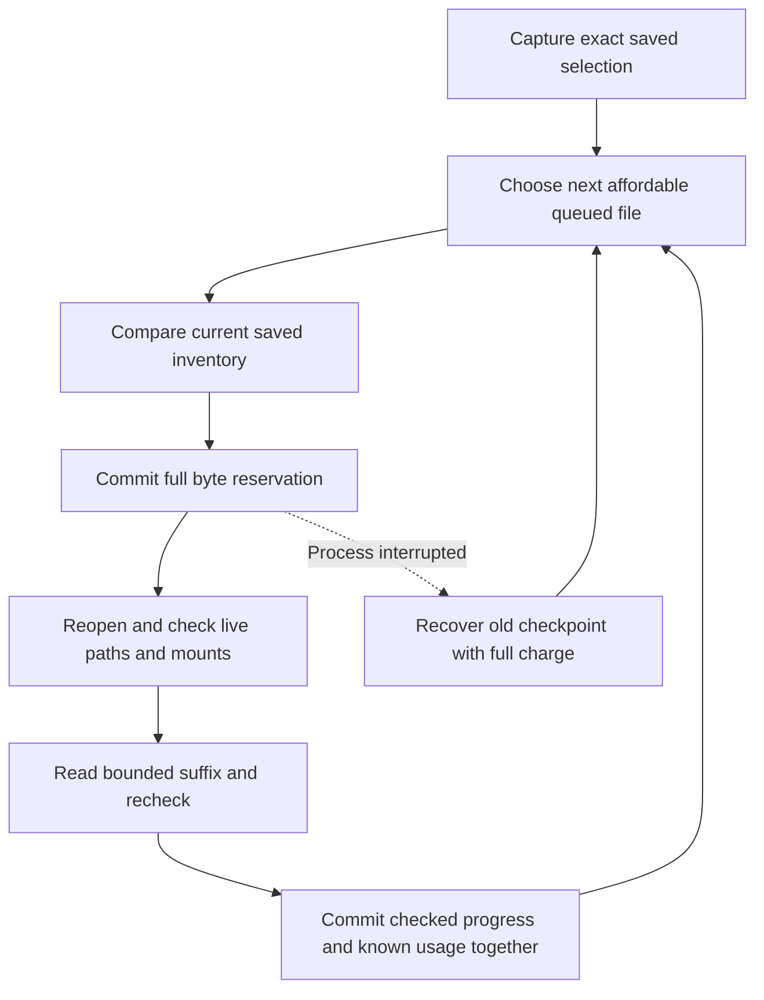

# Experimental inventory (P1-05)

## Activation and persistence

`rydd daemon --experimental-scan` runs one metadata inventory over configured roots, with persistent directory jobs. The flag must be supplied on every start. Ordinary daemon mode never dispatches inventory jobs, including ones left by an experimental run. Budget enforcement is still P1-06 work; use disposable fixtures only. Restarting experimental mode seeds a root revisit while preserving pending jobs. Adaptive scheduled revisits are P1-07 work.

Each batch reads at most 128 names via `File.Readdirnames(n)`, without sorting or loading a whole directory. It gathers no-follow stat metadata, including logical size, allocated blocks, modification/change times, device/inode hints, raw path bytes and skip reasons. Ordinary file contents are never opened. Allocated blocks do not prove exclusive ownership of extents or reclaimable space.

A single directory descriptor and its initial metadata stamp survive between batches. A cursor identifies the live stream's last committed batch, not a filesystem offset. On process restart, lost cursor, changed directory or cancellation, enumeration restarts with a new random generation. Idempotent upserts preserve committed observations. Directory continuation runs before child jobs so a bounded single-stream implementation makes progress; fair scheduling and durable continuation across repeated restarts remain P1-07 work. The default 128-name batch and five-minute cadence favor low activity over throughput.

The owning worker event loop uses one short transaction for lease validation, metadata upserts, child-job insertion, directory reconciliation state and cursor/completion. Rollback leaves all of them unchanged. Root/filesystem identity is bound in that transaction and must match future batches. Handlers never hold a database connection.

## Reconciliation and failures

Schema v3 adds `entries.skip_reason` and a `directories` table. A directory's generation is marked complete only at EOF after unchanged inode/device/mtime/ctime checks, including reopening its current path. Errors save a bounded message and schedule an hour-later retry; they never clear existing observations. Inaccessible child directories and excluded/mounted/provider paths receive skip reasons instead of traversal jobs.

The complete generation is a watermark for a successful direct-child pass. A child observation from another generation is unconfirmed in that pass. Retain those observations: no large SQL sweep or recursive deletion occurs during a batch. Descendant invalidation, stale-entry lifecycle and report filtering belong to P1-07/P1-08. Root `last_scan_ns` means its own directory was enumerated, not that the entire tree finished. Summary counts include historical observations; they are not proof that each saved pathname still exists or that coverage is complete.

Before/after metadata checks reduce path-change errors but cannot create an atomic filesystem snapshot. Device/inode fingerprints remain scoped hints, not future cleanup authorization. Later actions must freshly revalidate targets.

## Filesystem scope

Configured root aliases are resolved before opening. Available roots with overlapping canonical paths or identical filesystem objects are rejected at startup. Descendants are opened component-by-component with directory-only/no-follow flags and before/after identity checks. Symlinks are recorded as symlinks, not traversed. Exclusions, Rydd config/state/runtime paths, known system paths, the current user's macOS Library, `.git`, Trash and selected backup/snapshot directory names are protected. Existing protected objects are also recognized by device/inode, covering private-file aliases and case variations.

Root fingerprints include canonical path, filesystem identity, device and inode. A changed or missing root produces an error while preserving old inventory. Linux mount IDs are used for live boundaries, including same-filesystem bind mounts; they are deliberately excluded from persistent fingerprints because they change after remounting. macOS uses filesystem ID and mount location. Nested mounts are skipped even if their filesystem is otherwise supported.

The initial filesystem allowlist is deliberately small:

| Platform | Accepted filesystem metadata interfaces |
| --- | --- |
| macOS | APFS, HFS |
| Linux | ext-family, Btrfs, XFS, tmpfs, overlay (container fixtures) |

Other filesystem types, including FUSE/network providers, are refused. Linux requires `statx` mount IDs; unsupported kernels fail closed. Docker host bind shares may use an unsupported filesystem, so scanner fixtures use the container's `/tmp`. A physical device renumbering can conservatively invalidate a saved fingerprint; user-reviewed rebinding is not implemented yet. Do not erase an existing database to work around a mismatch.

macOS dataless flags are checked before opening directories and before traversal; known Library-based cloud roots are protected. Actual provider hydration/race behavior is not yet validated. Provider-managed roots must stay out of experimental tests and broad scanning until native avoidance controls and tests are complete. See [Apple TN3150](https://developer.apple.com/documentation/technotes/tn3150-getting-ready-for-data-less-files) and [Apple's flag definitions](https://github.com/apple/darwin-xnu/blob/main/bsd/sys/stat.h).

## Resource and validation boundaries

Metadata arrays and directory descriptors are bounded independently of tree size. Stored paths are limited to 4096 bytes and error/cursor sizes are bounded. Cooperative checks cannot interrupt an already blocked kernel filesystem call. Scanner close does not wait on that call during shutdown; the process can exit and a later owner recovers saved work. Full power/CPU/I/O consumption budgets and diagnostics are still required before unattended use.

Tests cover multi-batch restart, rollback after partial SQL work, stale lease/root identity rejection, symlinks, FIFOs, sparse/hardlinked files, private aliases, missing and permission-denied directories, root replacement and a killed worker completing a 20-level tree. Linux CI exercises a real bind mount in a private namespace. Native CLI smoke tests scan five synthetic entries and stop their worker. These are correctness fixtures, not a million-entry benchmark, physical laptop sleep/remount trial or provider-hydration guarantee.

API references: [Go directory enumeration](https://go.dev/src/os/dir.go), [Unix filesystem APIs](https://pkg.go.dev/golang.org/x/sys/unix).

## Paced partial batches

The worker supplies an entry-inspection rate. A throttle-window deadline produces a partial batch while preserving up to 128 pending names in the current stream. Final pathname/stamp validation still runs before that batch is committed. A throttle yield keeps the generation; actual cancellation, mutation, lost cursor or process restart retains the existing restart-and-upsert behavior. See [CLI contract](cli.md#child-entry-pacing) for the exact rate scope and remaining limits.

## Explicit file observations and durable hashing

Metadata scans still open no ordinary file contents. Separate library requests can capture exact saved evidence, observe bounded samples or calculate a full SHA-256 hash. These requests do not supply source-read consent or cleanup permission. `rydd hashes [--work WORK_ID] [--json]` reads existing historical observations and their whole-selection budget. CLI content reads, resumptions and background integration remain pending.

The durable hashing store keeps one frozen selection of 1–20 files, with at most 1 MiB of evidence, in a separate private `hashes/hashes.sqlite3` database. Its writer holds an exclusive lock for its lifetime. Inventory rebuilds do not remove hashing records. The store accepts no imported SHA state, caller-supplied offset, usage receipt or final digest.

Each call grants at most 1 MiB. A persisted indexed order rotates reserved work behind its peers, including after cancellation or recovery. Partial grants are rounded down to complete 64-byte SHA blocks. A smaller allowance defers without reservation or source reads, unless it can finish the exact remaining tail. A bounded search can let an affordable small tail proceed while a larger file waits. This is fairness within one finite batch, not a production scheduler or latency guarantee.

Partial checkpoints store the SHA chaining state at the last complete block and zero the entire buffered-byte area. Restart can repeat at most 63 checked bytes. Completed records contain only the final digest and cannot resume as prefix state. Version, runtime, platform, count, checksum and exact store/selection/file/sequence bindings are checked before reading. Incompatible records are refused; they never silently restart a file. The current saved inventory and live identity, stamp, scope and mount are checked on every continuation. Metadata checks cannot establish an atomic content snapshot across slices.

The reservation is permanent. Known usage and the next checked checkpoint are committed together; cancellation before publication retains the previous checkpoint while settling known usage. If a process dies before settlement, recovery keeps that checkpoint and the full charge. It marks requested/read/elapsed usage as unknown, rather than inventing zero. An uncertain publication stops dispatch until close and reopen. Previously committed progress survives a lost or canceled reply; a canceled request returns no live digest.

| Saved value | Meaning |
| --- | --- |
| Reserved bytes | Full allowances charged before reads; never refunded |
| Observed requested bytes | Read requests from attempts with known settlement |
| Observed read bytes | Bytes returned by those settled read requests |
| Unknown reserved bytes | Charges whose interrupted attempts have unknown usage |
| Durable offset | Checked prefix saved at a SHA block boundary, or completed file size |
| Completed digest | Historical full-read observation; no current-file or duplicate claim |

Unsettled reservations remain fully charged with null usage; the unknown-reservation counters include them only after writer recovery marks an interrupted attempt. Daily counters use the UTC day of reservation. A saved clock high-water blocks backward clock changes; rollover resets only current-day counters. These values do not measure physical disk I/O or limit reads by their actual wall-clock day. Storage retains only the latest checkpoint and attempt per file plus aggregate counters, with no per-slice history. Checksums detect inconsistent corruption and swapped records, not coherent same-user rewrites or whole-store rollback. Process-crash fixtures do not establish power-loss durability. All provenance, current-content, duplicate and execution flags remain false; estimated reclaimable bytes remain unknown.
